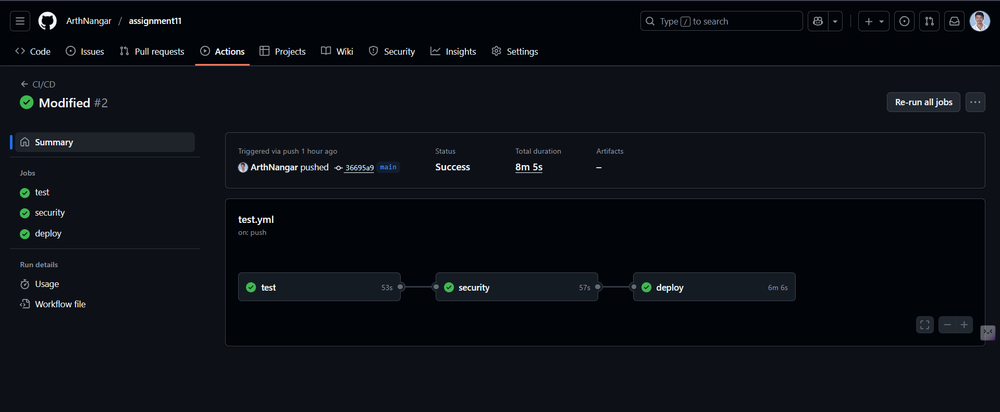
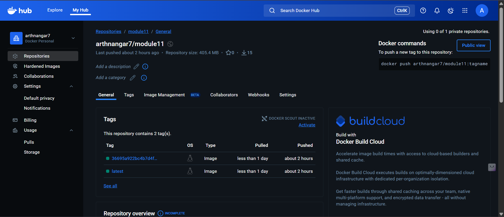
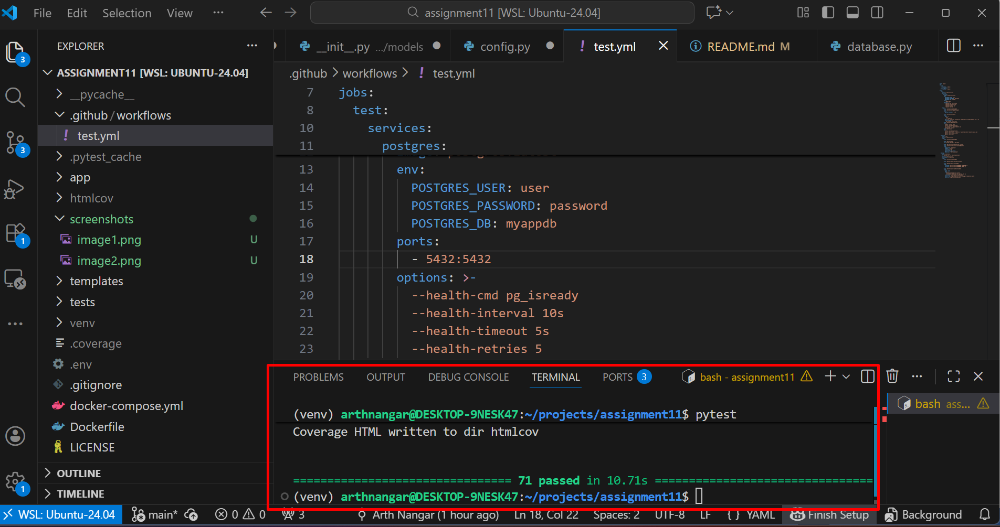

# Calculation Model & Factory Pattern – Module 11

Module 11: Implement and Test a Calculation Model with Optional Factory Pattern.

- A **SQLAlchemy model** for persisting calculations
- **Pydantic schemas** for validation and serialization
- An (optional but implemented) **Factory pattern** for `Add`, `Sub`, `Multiply`, `Divide`
- **Unit + integration tests** running in **GitHub Actions** with a PostgreSQL container
- A **Docker image** built and pushed to **Docker Hub** on successful CI

---

## 📂 Project Structure

```text

assignment11:--
.github/
└── workflows/
    └── test.yml
app/
├── core/
│   ├── __init__.py
│   └── config.py
│
├── models/
│   ├── __init__.py
│   ├── calculation.py
│   └── user.py
│
├── operations/
│   ├── __init__.py
│
└── schemas/
    ├── __init__.py
│   └── calculation.py

│   ── database.py

templates/
    └── index.html

tests/
├── __init__.py
├── conftest.py
│
├── unit/
│   ├── __init__.py
│   └── test_calculator.py
│
├── integration/
│   ├── __init__.py
│   ├── test_calculation_schema.py
│   ├── test_calculation.py
│   └── test_fastapi_calculator.py
│
└── e2e/
    ├── __init__.py
    └── test_e2e.py

.env
.gitignore  
docker-compose.yml  
Dockerfile  
LICENSE  
main.py  
MODULE11_SUMMARY.md  
pytest.ini  
README.md  
requirements.txt


```

## 🚀 Getting Started (Local Development)
```

1. Prerequisites Python 3.10+
2. Docker Desktop (for PostgreSQL + Docker image)
3. Git

Clone the Repository

git clone https://github.com/ArthNangar/assignment11.git
cd assignment11

Create and Activate a Virtual Environment

python -m venv venv
source venv/bin/activate      # macOS / Linux
# OR
venv\Scripts\activate         # Windows

Install Dependencies

pip install -r requirements.txt

Start PostgreSQL (Local)
You can either use your own PostgreSQL instance or run one with Docker:

Configure Environment Variables
Create a .env file in the project root:

To run the app: 
python main.py


Running the Tests:--

1. Run All Tests
pytest

2. Run Only Unit Tests

pytest tests/unit

```


##  CI/CD – GitHub Actions & Docker Hub

```
GitHub Actions Workflow (.github/workflows/test.yml)
On each push and pull request to main:

Set up Python

Install dependencies from requirements.txt

Run unit and integration tests with pytest

On success:

Build the Docker image

Push the image to Docker Hub


What CI/CD Pipeline do:

The GitHub Actions workflow automatically runs on every push and pull request.

Test – Executes all unit & integration tests with PostgreSQL service container.

Security – Scans built Docker images using Trivy for vulnerabilities.

Deploy – Builds and pushes the Docker image to Docker Hub upon successful tests.

```

## Required GitHub Secrets
DOCKERHUB_USERNAME

DOCKERHUB_TOKEN

The Docker image for this project is published to:

👉 Docker Hub: https://hub.docker.com/repository/docker/arthnangar7/module11

## Screenshots

### ✅ GitHub Actions – Successful CI/CD Run


### 🐳 Docker Hub – Image Successfully Pushed


### 🧪 Tests – All Passed with Coverage



## License

This project is licensed under the MIT License. See the LICENSE file for details.

## Acknowledgments

FastAPI Documentation

Docker Docs

PostgreSQL Docs

pgAdmin Docs


## 👨‍💻 Author
Arth Nangar

Date: 11/17/2025

Module 11